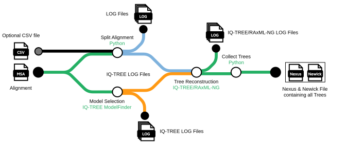
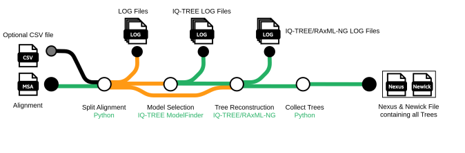

## Introduction

Automated-Window-Sliding is a bioinformatics pipeline that can be used as a starting point for sliding window based phylogenetic analysis. For this the input alignment is split into several subalignments using a sliding window approach or alternatively custom alignment ranges provided in a CSV file. For each of the subalignment windows a tree is reconstructed and in the end all trees are collected in a single Nexus/Newick file. This file can then be used to study effects that change the phylogenetic signal along the alignment, e.g. recombinations, reassortment and selection effects.




1. Split alignment into subalignments ([Python Script](bin/sliding_window.py))
2. Find best-fit evolutionary model for whole alignment or subalignments ([IQ-TREE ModelFinder](https://github.com/iqtree/iqtree2))
3. Run tree inference on each subalignment
   1. [IQ-TREE](https://github.com/iqtree/iqtree2)
   2. [RAxML-ng](https://github.com/amkozlov/raxml-ng)
4. Collect reconstructed trees in a single file ([Python Script](bin/collect_trees.py))
   1. Nexus
   2. Newick
   3. Both

## Installation

This pipeline runs on the Nextflow Workflow System. For the installation of Nextflow, please refer to [this page](https://www.nextflow.io/docs/latest/getstarted.html).

To run the pipeline the following programs are required:
   * [Python](https://www.python.org/downloads/) (tested with 3.11)
   * Python packages: [DendroPy](https://dendropy.org/), [Biopython](https://biopython.org/wiki/Download)
   * [IQ-TREE](http://www.iqtree.org/#download) ([RAxML-ng](https://github.com/amkozlov/raxml-ng) optional: if used for tree reconstruction)

If you do not want to manually install these dependencies you can run the pipeline with docker, singularity or conda by using `-profile <docker/singularity/podman/apptainer/conda/mamba>`. If you want to use your locally installed programs omit this parameter.

The pipeline can be downloaded via the nextflow pull command
```bash
nextflow pull enesBerkSakalli/automated-window-sliding
```
which automatically pulls the latest version of the pipeline into the folder `$HOME/.nextflow/assets` on your computer. This command is also used to update the pipeline to the latest version.

Alternatively the nextflow run command can be used to pull the pipeline and then run it immediately 
```bash
nextflow run enesBerkSakalli/automated-window-sliding <additional options>
```

You can also clone the repository and use the pipeline this way. Here you have to use the `nextflow run` and provide the path to the `main.nf` file.

```bash
git clone https://github.com/enesBerkSakalli/automated-window-sliding.git
```

```bash
nextflow run <path/to/cloned/repository>/main.nf <additional options>
```

## Usage

To check if everything works correctly the pipeline can be run on a minimal test case by using `-profile test`:

```bash
nextflow run enesBerkSakalli/automated-window-sliding -profile test -outdir <OUTDIR>
```

You can use multiple profile options in a single run, for example `-profile test,docker` to run the minimal test case with docker.

To run the pipeline on your own data provide a multiple sequence alignment (only accepts FASTA, PHYLIP, NEXUS, MSF, CLUSTAL) with `--input`:

```bash
nextflow run enesBerkSakalli/automated-window-sliding --input <ALIGNMENT> --outdir <OUTDIR>
```

To view available pipeline parameters use:
```bash
nextflow run enesBerkSakalli/automated-window-sliding --help
```

### Key Parameters

**Basic Options:**
- `--input` - Input alignment file (FASTA, PHYLIP, NEXUS, MSF, CLUSTAL)
- `--outdir` - Output directory for results
- `--window_size` - Size of sliding windows (default: 500)
- `--step_size` - Step size between windows (default: 100)

**Tree Rooting Options:**
- `--mad_rooting` - Enable MAD rooting with RootDigger (default: true)
- `--rootdigger_strategy` - Rooting strategy: `modified-mad` (default), `midpoint`, `random`
- `--rootdigger_exhaustive` - Enable exhaustive search for higher accuracy (default: false, slower)

**Analysis Options:**
- `--phylo_method` - Tree inference method: `iqtree2` (default) or `raxml-ng`
- `--model_criterion` - Model selection criterion: `bic` (default), `aic`, `aicc`
- `--output_format` - Output format: `nexus,newick` (default), `nexus`, `newick`

For complete parameter documentation, see the [Usage Guide](docs/usage.md) and [RootDigger Optimization Guide](docs/rootdigger_optimization.md).

For more information about the usage and output of the pipeline refer to the full [Documentation](docs/README.md) of this project.

In addition to the pipeline specific parameters there are several parameters that Nextflow provides. These are invoked with a single dash, e.g. `-resume` to resume a previously failed pipeline run or `-qs <int>` to limit the number of parallel processes. For a full overview of Nextflow CLI parameters please refer to [this page](https://www.nextflow.io/docs/latest/cli.html) or use `nextflow run -h`

## 🔍 Results Directory Structure

**All results are automatically organized in a structured `results/` directory.**

Each analysis run creates a timestamped subdirectory with complete analysis outputs:

```
results/
├── [INPUT]_w[WINDOW]_s[STEP]_[MODEL]_[TIMESTAMP]/    # Individual run results
│   ├── analysis_metadata.txt                        # Run parameters
│   ├── original_alignment_[INPUT].fasta            # Input alignment copy
│   ├── tree_reconstruction_logs/                   # Detailed logs
│   └── rooted_trees/                               # MAD rooted trees
├── best_trees.newick/.nexus                        # Combined tree collections
├── best_rooted_trees.newick/.nexus                 # Combined rooted trees
└── pipeline_info/                                  # Execution reports
```

**Key Benefits:**
- 🗂️ **Organized**: All outputs in structured directories
- 🔄 **Reproducible**: Complete metadata and input preservation  
- 📊 **Accessible**: Summary files for quick analysis
- ⏰ **Versioned**: Timestamped runs prevent overwrites

For detailed information, see [Results Structure Guide](docs/RESULTS_STRUCTURE.md).

### Analysis Output Files

* **`original_alignment_<filename>.fasta`** - Copy of the input alignment for reproducibility
* **`analysis_metadata.txt`** - Complete metadata about the analysis parameters and environment
* **`models.txt`** - Selected evolutionary models for each window
* **`windows.txt`** - Window coordinates and statistics
* **`removed_sequences.txt`** - Sequences removed from each window

### Tree Files

* **`trees_<format>.txt`** - Combined tree files in specified format(s)
* **`rooted_trees/`** - MAD-rooted trees (if rooting enabled)
* **Individual window trees** - Separate tree files for each sliding window

### Logs and Reports

* **`model_finder_logs/`** - Model selection logs and IQ-TREE output
* **Process-specific logs** - Detailed execution logs for debugging

### Example Output Directory

```text
results/
└── aligned_norovirus_sequences_w500_s100_GTR_G_I_20250617_143022/
    ├── original_alignment_aligned_norovirus_sequences.fasta
    ├── analysis_metadata.txt
    ├── models.txt
    ├── windows.txt
    ├── removed_sequences.txt
    ├── trees_nexus.txt
    ├── rooted_trees/
    │   ├── window_1_rooted.tree
    │   └── ...
    └── model_finder_logs/
        ├── logs/
        └── iqtree/
```

## 📊 Log Management

The pipeline automatically organizes all logs and work files in a dedicated `logs/` directory to keep the project root clean:

* `logs/work/` - Nextflow work directory with task execution files
* `logs/trace/` - Execution reports, timelines, and DAG visualizations
* `logs/process/` - Individual process logs

### Viewing Execution Reports

After pipeline completion, view detailed execution reports:

* `logs/trace/execution_report.html` - Comprehensive execution statistics
* `logs/trace/execution_timeline.html` - Timeline visualization
* `logs/trace/pipeline_dag.html` - Pipeline DAG visualization

### Cleaning Logs

To clean up logs from previous runs:

```bash
./clean-logs.sh
```

Or manually:

```bash
rm -rf logs/work/* logs/trace/*
```

## Citations

An extensive list of references for the tools used by the pipeline can be found in the [`CITATIONS.md`](CITATIONS.md) file.
